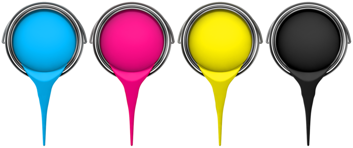

    

# Color Picker

Este projeto foi desenvolvido utilizando HTML5, CSS3 e Javascript. Durante sua elaboração, foi possível aprimorar habilidades de manipulação do DOM e personalizar a aparência da página de acordo com as preferências do usuário.

## Tecnologias Utilizadas

   
 

     
 

 

    Confira <a href="https://mendjoy.github.io/color_picker/">aqui</a>

 
